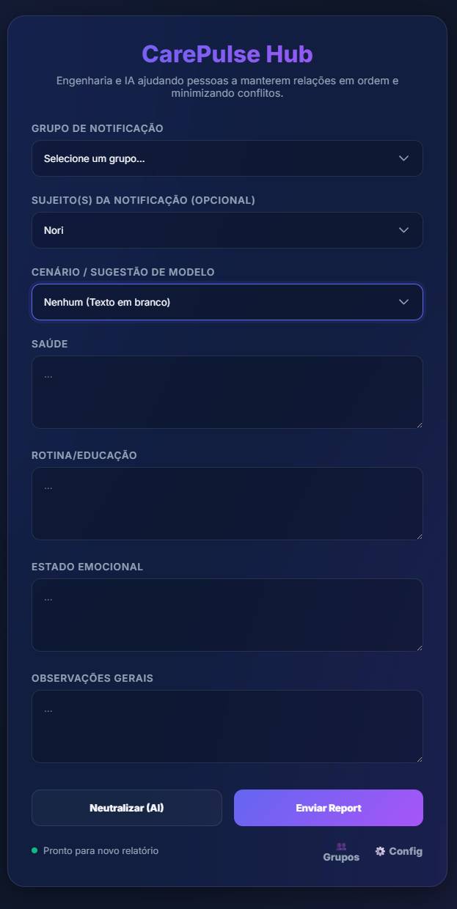
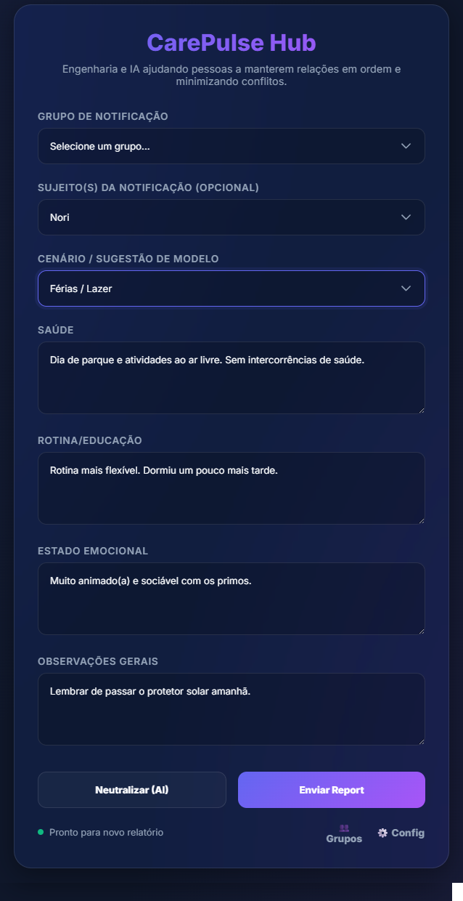
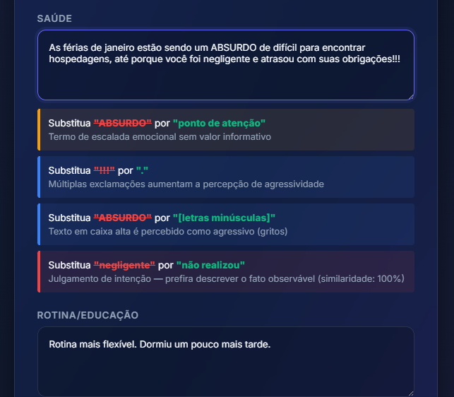
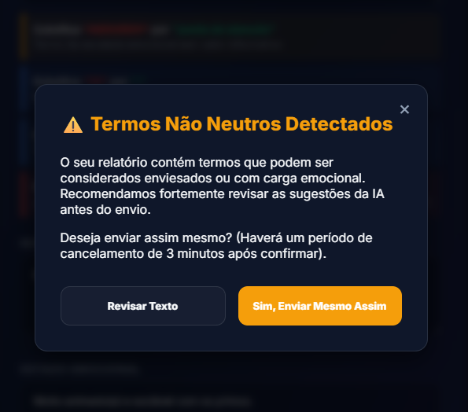
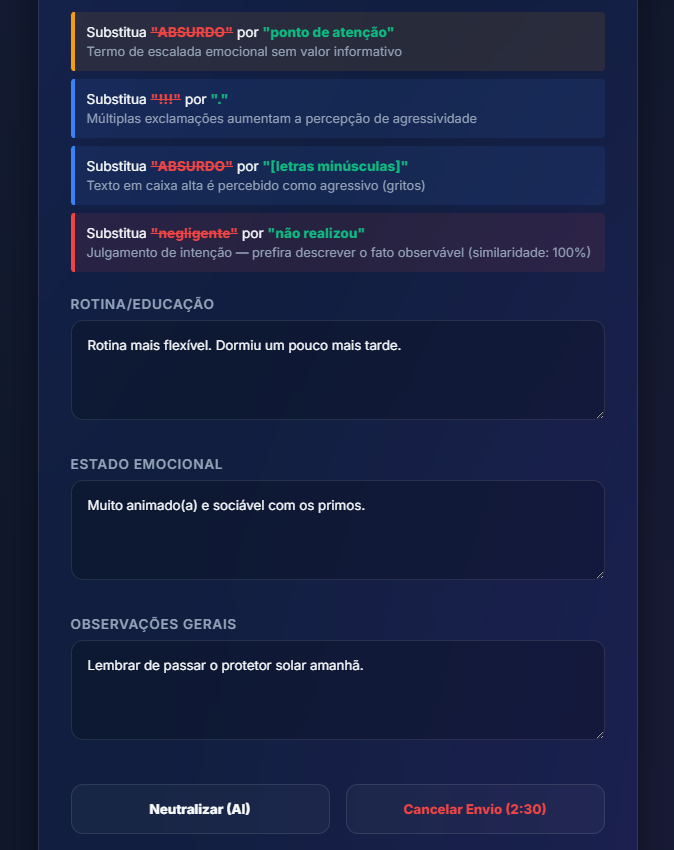
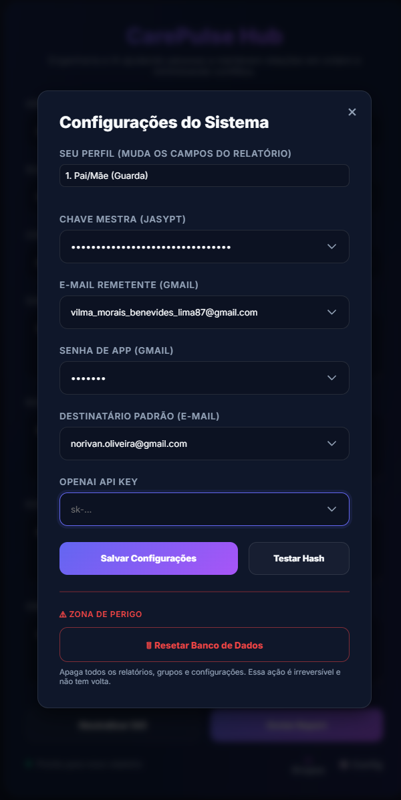

# 🚀 CarePulse Hub - Showcasing Human-Centered Engineering

[Português](#português) | [English](#english)

---

## 🇺🇸 English Showcase

### 1. The Main Dashboard
> 
> *Clean, minimal, and focused on the task. No distractions, just care.*

### 2. Scenario-Based Suggestions
> 
> *Professional templates to help you communicate clearly and neutrally, even in stressful situations.*

### 3. AI Neutralization Layer (New!)
> 
> *1. Real-time feedback identifying emotional or biased language.*
>
> 
> *2. Confirmation modal blocking the submission until the user acknowledges the AI feedback.*
>
> 
> *3. Impulse Control: A 3-minute cancelable delay to ensure the report is sent with a "cool-off" mindset.*

### 4. Smart Configuration
> 
> *Privacy first. Your credentials never leave your machine; they are encrypted locally.*

---

## 🇧🇷 Demonstração (Português)

### 1. Painel Principal
> 
> *Interface limpa, minimalista e focada na tarefa. Sem distrações, apenas cuidado.*

### 2. Sugestões Baseadas em Cenários
> 
> *Modelos profissionais para ajudar você a se comunicar de forma clara e neutra, mesmo em situações estressantes.*

### 3. Camada de Neutralização IA (Novo!)
> 
> *1. Feedback em tempo real identificando termos emocionais ou enviesados.*
>
> 
> *2. Modal de confirmação que interrompe o envio até que o usuário revise o feedback da IA.*
>
> 
> *3. Controle de Impulso: Um atraso cancelável de 3 minutos para garantir que o relatório seja enviado após "esfriar a cabeça".*

### 4. Configuração Inteligente
> 
> *Privacidade em primeiro lugar. Suas credenciais nunca saem da máquina; são criptografadas localmente.*

---

## 💡 The Vision / A Visão

Communication loaded with emotion or ambiguity creates friction and distrust. **CarePulse Hub** acts as a neutral layer, ensuring that reports are objective, organized, and factual.

Comunicações carregadas de emoção ou ambiguidade geram atrito e desconfiança. O **CarePulse Hub** atua como uma camada neutra, garantindo que os relatórios sejam objetivos, organizados e factuais.

---

[Back to README](README.md)
